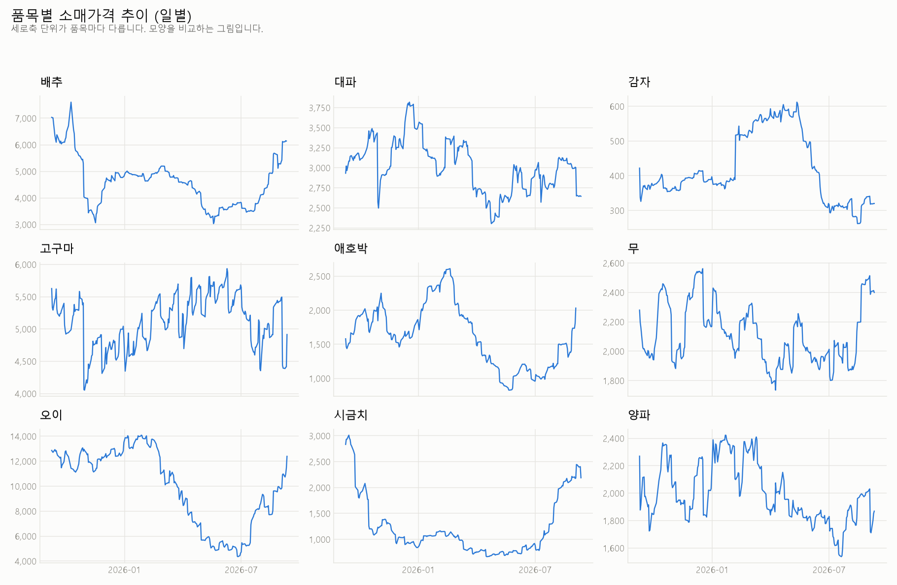
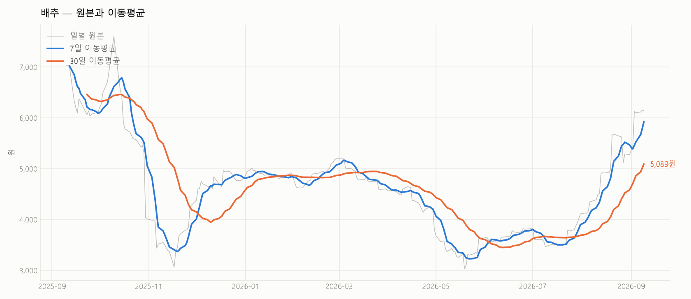
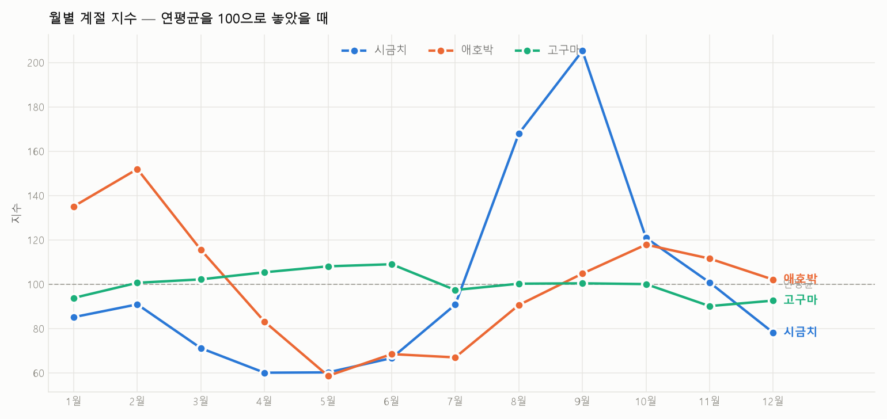
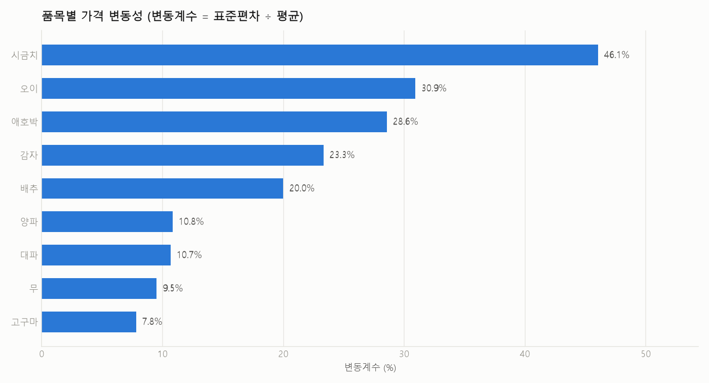
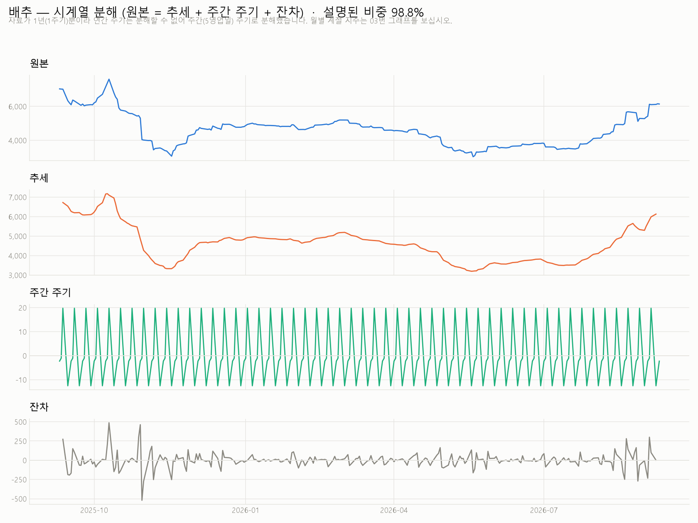
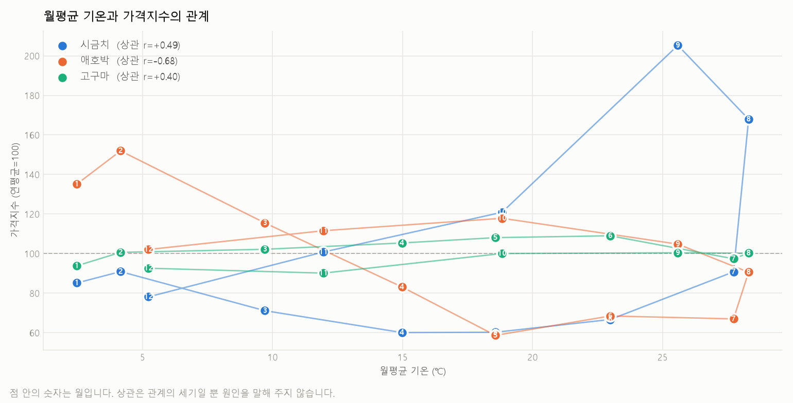

# 제철밥상 시계열 분석 리포트

**작성자** 김진아
**저장소** https://github.com/80gina/jecheol-planner
**대시보드** https://claude.ai/code/artifact/6b7c06c4-b5e6-4ae6-8f8c-bd2c13d46c41
**작성일** 2026-09-14
**분석 기간** 2025-09-10 ~ 2026-09-10 (영업일 기준)

---

## 1. 분석 주제 및 선정 이유

### 무엇을 분석했나

평생학습센터 요리교실에서 실제로 쓰는 **식재료 9종의 일별 소매가격**을 분석했다.
여기에 **창원 지역 일별 기온**을 붙여, 가격 변동의 배경을 함께 살폈다.

### 왜 이 주제인가

요리교실을 운영할 때마다 되풀이되는 문제가 있다.
**한 달 전에 짠 식단표의 재료비가 수업 당일에 맞지 않는다.**
배추 한 포기가 3천 원이던 것이 6천 원이 되어 있으면, 12인 기준 수업의
재료비 계획이 통째로 어긋난다.

그래서 알고 싶었던 것은 하나다.
**"제철에 사면 싸다"는 말이 데이터로 사실인가, 그리고 얼마나 사실인가.**

이 질문은 검색으로는 답이 안 나온다. "배추는 겨울이 제철"이라는 정보는 흔하지만,
**"그래서 9월에는 5월보다 몇 % 더 내야 하는가"** 는 아무도 알려주지 않는다.
가격 데이터를 직접 봐야 나오는 숫자다.

### 기존 프로젝트와의 연결

이 분석은 별도 과제가 아니라, 진행 중이던 **제철밥상 플래너**(`jecheol-planner`)의
가격 수집 모듈을 시계열 분석용으로 확장한 것이다.
플래너의 목표가 "지금 싼 재료로 식단을 짜는 것"이므로,
"무엇이 언제 싼가"를 아는 것이 그 앞 단계에 해당한다.

---

## 2. 분석 질문

| # | 질문 | 성격 |
|:-:|------|------|
| Q1 | "제철에 사면 싸다"는 말은 데이터로 확인되는가? 품목별로 가장 싼 달과 가장 비싼 달은 언제인가? | 그래프로 확인 가능 |
| Q2 | 계절성이 강한 품목과 약한 품목은 무엇이 다른가? 재배·저장 방식과 관계가 있는가? | 해석 필요 |
| Q3 | 가격이 오르내리는 이유를 기온으로 설명할 수 있는가? 설명되는 부분과 안 되는 부분은 각각 얼마인가? | 해석 필요 |
| Q4 | 관측 기간 동안의 추세와 주기 변동은 각각 얼마나 되는가? | 그래프로 확인 가능 |
| Q5 | 요리교실 식단을 짤 때 **어떤 재료를 어느 달에 배치**해야 재료비가 안정적인가? | 실무 적용 |

> Q1·Q4는 그래프로 바로 답이 나온다. Q2·Q3은 그래프에서 얻은 사실에 해석을 얹어야 한다.
> Q5는 이 분석을 실제로 쓰는 자리다.

---

## 3. 데이터 설명

### 3-1. 가격 데이터

| 항목 | 내용 |
|------|------|
| 출처 | KAMIS 농산물유통정보 (한국농수산식품유통공사) |
| 조회 방식 | Open-API `periodProductList` (기간별 품목 시세) |
| 구분 | 소매가격 (`p_productclscode=01`), 등급 상품(`04`), 지역 평균 |
| 기간 | **2025-09-10 ~ 2026-09-10** |
| 품목 수 | 9종 |
| 데이터 포인트 | 원본 **9,501행** (과제 요구 100개 이상) |
| 라이선스 | 공공누리 제4유형 — 출처표시, 상업적 이용금지, 변경금지 |

#### ⚠️ 기간이 2년이 아니라 1년인 이유 — 확인된 사실

수집 명령은 2년치(`--years 2`, 2024-09 ~ 2026-09)를 요청했으나
실제로 받은 자료는 **2025-09-10 부터**였다. 원인을 추정으로 두지 않고 직접 확인했다.

진단 스크립트 `probe_history.py` 로 과거 구간을 3개월 단위로 나누어 조회한 결과
(2026-09-14 실행):

| 조회 구간 | 오늘 기준 | 결과 |
|---|---|---|
| 2026-06-01 ~ 08-31 | 3개월 전 | ✅ 6,300줄 |
| 2026-01-01 ~ 03-31 | 8개월 전 | ✅ 2,950줄 |
| 2025-09-15 ~ 12-15 | 1년 전 | ✅ 5,880줄 |
| 2025-06-01 ~ 08-31 | 1년 3개월 전 | ❌ HTTP 500 |
| 2024-10-01 ~ 12-31 | 2년 전 | ❌ HTTP 500 |
| 2024-01-01 ~ 03-31 | 2년 8개월 전 | ❌ HTTP 500 |

**결론 두 가지.**

1. **KAMIS 기간 조회는 오늘 기준 최근 약 1년만 제공한다.** 경계가 1년 전에 정확히 놓여 있고,
   수집 데이터의 시작일(2025-09-10)이 수집 실행일(2026-09-10)의 정확히 365일 전이다.
   고정된 시작점이 아니라 **오늘을 따라 움직이는 창**이다.
2. **범위 밖 구간은 "자료 없음"이 아니라 HTTP 500 으로 응답한다.**
   이것이 이 사실이 조용히 지나간 이유다. 수집 코드는 500을 일시적 서버 장애로 보고
   재시도한 뒤 넘어가므로, "2년을 요청했는데 1년만 받았다"는 상황이 오류처럼 보이지 않았다.

이 한계는 9장에 그대로 적었고, 분해 기법의 선택(5장)에도 직접 영향을 주었다.

### 3-2. 기상 데이터

| 항목 | 내용 |
|------|------|
| 출처 | 기상청 지상(종관, ASOS) 일자료 — 공공데이터포털 |
| 관측지점 | 창원 (지점번호 155) |
| 항목 | 평균·최저·최고기온, 일강수량 |
| 기간 | 2024-09 ~ 2026-09 |
| 데이터 포인트 | **731행** |
| 라이선스 | 공공누리 제1유형 — 출처표시 |

> 기상 자료는 2년치가 모두 내려왔다. 가격 쪽만 1년인 것은 KAMIS 고유의 제약이다.
> 분석은 두 자료가 겹치는 구간에서만 이루어진다.

### 3-3. 분석 대상 9품목과 선정 이유

품목은 **짝을 지어** 골랐다. 혼자 있는 숫자는 해석이 안 되기 때문이다.

| 짝 | 품목 | 역할 | 확인하려는 것 |
|---|------|------|---------------|
| **정반대 짝** | 시금치 ↔ 오이 | 나물 / 반찬 | 겨울 제철 vs 여름 제철 — 곡선이 거울처럼 뒤집히는가 |
| **같이 가는 짝** | 배추 ↔ 무 | 국·김치 / 국물 | 둘 다 김장 수요 — 같은 달에 같이 오르는가 |
| **닮은 짝** | 감자 ↔ 고구마 | 면·밥 / 간식 | 둘 다 저장 작물 — 저장이 계절성을 얼마나 눌러주는가 |
| **대조군** | 양파 | 양념·대조군 | 장기 저장 품목 — 계절성이 **약해야** 한다 |
| **공통 재료** | 대파 | 양념 | 거의 모든 메뉴에 들어감 — 전 회차 원가에 영향 |
| **소액 재료** | 애호박 | 볶음 | 값은 작지만 12인 수업에서 누적됨 |

> **대조군을 넣은 이유가 중요하다.** "배추는 계절을 탄다"만 보여주면
> "원래 다 그런 것 아니냐"는 반문을 막을 수 없다.
> 계절성이 **약한** 품목을 나란히 놓아야 "다른 건 안 그런데 배추는 그렇다"가 성립한다.

**대조군을 콩나물에서 양파로 바꿨다.** 처음 설계는 실내 재배라 계절성이 아예 없어야 하는
콩나물이었다. 그러나 `codes` 명령으로 KAMIS 채소류 31개 품목을 실제로 받아보니
**콩나물이 목록에 없었다.** 문서를 보고 코드를 짐작해 넣었다면 조회 실패로 끝났을 자리다.
차선으로 장기 저장이 가능해 계절성이 약할 것으로 기대되는 양파를 택했다.
실내 재배만큼 완전한 대조군은 아니므로, 그 한계도 아래 7장에 함께 적었다.

---

## 4. 데이터 정제

### 4-1. 기본 정보 확인

| 확인 항목 | 결과 |
|-----------|------|
| 기간 | 2025-09-10 ~ 2026-09-10 |
| 컬럼 | date, key, item, kind, category, role, price |
| 원본 행수 | **9,501행** |
| 중복 제거 | **7,310행** (완전히 동일한 행) |
| 정제 후 행수 | **2,330행** |
| 영업일 커버리지 | 262 영업일 중 품목당 243~244일 (**약 93%**) |

**중복 7,310행의 정체.** 다섯 품목(대파·고구마·애호박·오이·시금치)에서 같은 날짜가
7번씩 반복되었다. 가격까지 완전히 동일한 행이라 평균을 왜곡하지 않지만,
그대로 두면 "관측 수"를 7배로 부풀린다. `clean()` 의 첫 단계가
`drop_duplicates(subset=["date","key"])` 인 것이 이 때문이다.

### 4-2. 처리 기준과 근거

| 무엇 | 기준 | 왜 이렇게 정했나 |
|------|------|------------------|
| **달력** | 월~금 영업일만 센다 | 주말은 애초에 시세 조사를 하지 않는다. 주말을 만들어 메우면 **없는 거래를 지어내는 것**이 된다 |
| **결측** | 연속 3일 이하만 선형보간, 그 이상은 결측으로 남김 | 공휴일 연휴 정도는 앞뒤를 이어도 무리가 없다. 길게 빈 구간까지 메우면 데이터를 창작하는 셈 |
| **이상치** | 31일 **이동중앙값** 대비 ±50% 밖 | 평균이 아니라 **중앙값**을 쓴 것이 핵심. 평균은 튄 값 자체에 끌려가서 이상치를 못 잡는다 |

### 4-3. 품목별 처리 결과

`python main.py analyze` 실행 시 터미널에 출력되는 값 그대로다.
같은 내용이 `data/summary.json` 의 `정제` 항목에 저장된다.

| 품목 | 결측일 | 이상치 | 보간 | 최종 관측 |
|------|-------:|-------:|-----:|----------:|
| 배추 | 18 | 0 | 16 | 259 |
| 무 | 18 | 0 | 16 | 259 |
| 시금치 | 18 | 0 | 16 | 260 |
| 오이 | 18 | 0 | 16 | 260 |
| 애호박 | 18 | **5** | 16 | 254 |
| 대파 | 18 | 0 | 16 | 260 |
| 양파 | 18 | 0 | 16 | 259 |
| 감자 | 18 | 0 | 16 | 259 |
| 고구마 | 18 | 0 | 16 | 260 |

**읽는 법 세 가지.**

- **결측 18일이 전 품목 동일**하다. 특정 품목의 조사 누락이 아니라 **공휴일**이라는 뜻이다.
  품목마다 제각각이었다면 수집 쪽을 의심해야 했다.
- **보간 16일 / 결측 18일** — 2일은 메우지 못했다. 3일을 넘게 이어 빈 구간(연휴)이라
  기준대로 결측으로 남겼다. 기준이 실제로 작동했다는 증거다.
- **이상치가 애호박에만 5건.** 다른 품목은 0이다. 애호박은 CV 28.6%로
  변동이 큰 편이라 이동중앙값에서 벗어나는 날이 나온 것으로 보인다.

---

## 5. 적용한 시계열 분석 기법

과제 요구는 2가지 이상이다. 6가지를 적용했다.

| # | 기법 | 왜 필요했나 | 어떻게 했나 |
|:-:|------|-------------|-------------|
| 1 | **이동평균** (7일·30일) | 일별 원본은 잔떨림이 심해 방향이 안 보인다 | 후행 이동평균. 7일은 주 단위 요동을, 30일은 월 단위 흐름을 본다 |
| 2 | **변화율** (1일·30일) | 급등·급락이 **언제** 일어났는지 찾기 위해 | `pct_change()` |
| 3 | **월별 계절 지수** | 배추(4천 원대)와 감자(4백 원대)를 한 그림에 못 올린다 | 각 품목의 평균을 100으로 놓고 월평균을 지수화 |
| 4 | **변동계수** (CV) | 표준편차만 보면 "비싼 품목이 많이 흔들린다"는 당연한 결론만 나온다 | 표준편차 ÷ 평균 × 100 |
| 5 | **시계열 분해** (보너스) | 추세·주기·잔차를 갈라 봐야 "실제로 얼마나 움직인 것인가"가 나온다 | 고전적 가법 분해를 직접 구현 |
| 6 | **베이스라인 예측** (보너스) | 어떤 모델이든 "이것보다는 나아야 한다"는 기준선이 없으면 정확도를 말할 수 없다 | 직전값 유지 · 주간 반복 · 7일 평균 세 가지를 20영업일 홀드아웃으로 검증 (13장) |

### 5-1. 시계열 분해를 직접 구현한 이유

`statsmodels.seasonal_decompose` 를 부르면 한 줄로 끝난다.
그러나 **"어떻게 분해했는가"에 답할 수 없게 된다.**
고전적 분해는 이동평균 세 번이면 되므로 직접 짰다. (`analyze.py` 의 `decompose()`)

```
1) 추세   : 주기 길이만 한 중심 이동평균
            → 한 주기를 통째로 평균 내면 주기 성분이 서로 상쇄되고 긴 흐름만 남는다
2) 주기성분: (원본 − 추세) 를 '주기 안 어느 위치인가'로 묶어 평균
3) 잔차   : 원본 − 추세 − 주기성분. 설명되지 않고 남은 부분
```

### 5-2. 연간 주기 대신 주간 주기로 분해한 이유 — 자료 길이의 제약

애초 설계는 **연간 주기(261 영업일)** 분해였다. 그러나 3-1에서 확인했듯
자료가 1년(261 영업일)뿐이다.

고전적 분해는 **주기 길이만 한 창이 자료 안에서 두 번 이상 채워져야**
추세와 주기를 가를 수 있다. 261일 자료에 261일 창을 씌우면 창이 그 조건을 못 채우고,
추세가 사실상 전부 비어 계절성·잔차도 따라서 빈다. 그리는 것 자체가 불가능하다.

그래서 `pick_period()` 를 두어 **자료 길이에 맞는 주기를 고르게** 했다.

| 자료 길이 | 고르는 주기 | 근거 |
|---|---|---|
| 2년(522영업일) 이상 | 연간 261영업일 | 창이 두 번 이상 채워진다 |
| 그 미만 | **주간 5영업일** | 261일이면 약 52주기 — 통계적으로 충분하다 |

**주간 주기가 억지가 아닌 이유.** 요일 효과는 시장에서 실재한다. 주말 장보기를 앞둔
금요일에 수요가 몰리고 월요일에 가라앉는다. 실제 결과도 그 방향으로 나왔다(7장 인사이트 4).

**다만 이것이 "계절성"을 대체하지는 못한다.** 연간 계절성은 **월별 계절 지수**(그림 3)로
따로 다루되, 1주기만 관측되었으므로 "매년 반복된다"가 아니라
**"관측된 한 해의 모양"** 으로만 읽는다. 이 구분을 7·9장에서 계속 유지했다.

---

## 6. 분석 결과 및 시각화

### 그림 1 — 품목별 가격 추이



9품목을 한 판에 겹치면 아무것도 안 보이므로 **9칸으로 나눴다**(small multiples).
세로축 단위가 품목마다 다르므로 **값이 아니라 모양을 비교하는 그림**이다.

**관찰**: 물결이 뚜렷한 품목과 거의 평평한 품목이 눈으로 갈린다.
시금치·오이·애호박은 큰 산과 골이 있고, 고구마·무·대파는 완만하다.
양파(대조군)는 좁은 띠 안에서 움직인다(1,537~2,423원, 1.6배).

---

### 그림 2 — 원본과 이동평균



**관찰**: 배추 기준으로 7일선은 원본의 잔떨림을 걷어내고도 급등·급락 시점을 남기는 반면,
30일선은 그 시점을 뭉개고 방향만 보여준다. 두 선이 크게 벌어지는 구간이
값이 빠르게 움직인 구간이다.

> 집계 단위를 왜 일별로 골랐나: 요리교실 장보기는 **특정 날짜 하루**에 이루어진다.
> 월별로 뭉개면 "그 날 얼마였나"를 잃는다. 대신 잔떨림이 심해져 이동평균을 함께 그렸다.

---

### 그림 3 — 월별 계절 지수



평균을 100으로 놓았다. **120이면 그 달은 평소보다 20% 비싸다**는 뜻이다.

**관찰** — 품목별 최고월·최저월과 진폭:

| 품목 | 최고월 (지수) | 최저월 (지수) | 진폭 |
|---|---|---|---:|
| **시금치** | 9월 (205.3) | 4월 (60.1) | **145.2p** |
| **애호박** | 2월 (151.9) | 5월 (58.7) | 93.3p |
| **오이** | 1월 (137.7) | 6월 (50.7) | 87.0p |
| **감자** | 4월 (138.2) | 8월 (72.1) | 66.1p |
| **배추** | 9월 (134.9) | 5월 (73.8) | 61.1p |
| 양파 *(대조군)* | 1월 (117.2) | 7월 (84.6) | 32.6p |
| 대파 | 12월 (117.5) | 4월 (85.0) | 32.5p |
| 무 | 12월 (111.9) | 4월 (90.2) | 21.7p |
| 고구마 | 6월 (109.0) | 11월 (90.1) | **18.9p** |

품목 전체 표는 `data/seasonal_index.csv` 에 있다(부록 A).

---

### 그림 4 — 품목별 변동성



**관찰** — 변동계수(CV) 순위:

| 순위 | 품목 | CV | 평균가 | 최저 → 최고 | 배수 |
|:--:|---|---:|---:|---|---:|
| 1 | **시금치** | **46.1%** | 1,221원 | 665 → 3,012원 | 4.5배 |
| 2 | 오이 | 30.9% | 9,926원 | 4,357 → 14,087원 | 3.2배 |
| 3 | 애호박 | 28.6% | 1,614원 | 827 → 2,611원 | 3.2배 |
| 4 | 감자 | 23.3% | 421원 | 262 → 612원 | 2.3배 |
| 5 | 배추 | 20.0% | 4,598원 | 3,032 → 7,606원 | 2.5배 |
| 6 | 양파 *(대조군)* | 10.8% | 2,001원 | 1,537 → 2,423원 | 1.6배 |
| 7 | 대파 | 10.7% | 3,023원 | 2,303 → 3,819원 | 1.7배 |
| 8 | 무 | 9.5% | 2,115원 | 1,735 → 2,562원 | 1.5배 |
| 9 | **고구마** | **7.8%** | 5,111원 | 4,053 → 5,935원 | 1.5배 |

**가장 흔들리는 시금치(46.1%)와 가장 안정된 고구마(7.8%)의 차이는 5.9배다.**

---

### 그림 5 — 시계열 분해 (보너스)



배추를 대상으로 했다. 5-2에서 설명한 대로 **주간(5영업일) 주기**로 분해했다.

**관찰**:

| 성분 | 값 |
|---|---|
| 추세 시작 → 끝 | 6,722원 → 6,129원 (**−8.8%**) |
| 주기 성분 진폭 | **32.3원** |
| 잔차 표준편차 | 99.2원 |
| 설명된 비중 | **98.8%** |

요일별 주기 성분(추세 대비 편차):

| 월 | 화 | 수 | 목 | 금 |
|---:|---:|---:|---:|---:|
| −12.5원 | −7.3원 | −2.3원 | −1.0원 | **+19.8원** |

---

### 그림 6 — 기온과 가격의 관계



가로축 기온, 세로축 가격지수. 점 안의 숫자는 월이다.

> **이중축을 쓰지 않은 이유**: 기온(℃)과 가격(원)은 단위가 전혀 다르다.
> 한 그림에 세로축을 둘 두면 두 선이 만나는 지점이 아무 뜻도 없는데
> 뜻이 있어 보인다. 산점도로 놓으면 축은 하나씩만 쓰면서 관계를 그대로 볼 수 있다.

**관찰** — 월평균 기온과 월별 가격지수의 상관계수 r:

| 품목 | r | 방향 |
|---|---:|---|
| **양파** | **−0.79** | 추울수록 비싸다 |
| 애호박 | −0.68 | 추울수록 비싸다 |
| 오이 | −0.63 | 추울수록 비싸다 |
| 대파 | −0.52 | 추울수록 비싸다 |
| 감자 | −0.44 | 추울수록 비싸다 |
| 무 | −0.37 | 약하게 추울수록 비싸다 |
| **배추** | **−0.04** | 거의 관계 없음 |
| 고구마 | +0.40 | 더울수록 비싸다 |
| **시금치** | **+0.49** | 더울수록 비싸다 |

> ⚠️ **상관은 인과가 아니다.** 기온이 낮은 달에 값이 비싸다 해도,
> 추워서 비싼 것인지 다른 요인이 겹친 것인지 이 그림만으로는 못 가른다.
> 또한 이 r은 **월평균 12점**으로 계산한 값이라 표본이 작다.

---

## 7. 인사이트

> **형식 규칙**: 관찰(Fact)에는 반드시 **숫자와 그림 번호**를 넣는다.
> 원인(Why)은 가설이므로 "~로 보인다", "~일 가능성이 있다"로 쓴다.
> 둘을 섞어 쓰면 안 된다.

### 인사이트 1 — 제철은 싸다. 다만 품목마다 폭이 7배 넘게 다르다

| | |
|---|---|
| **관찰 (Fact)** | 그림 3에서 시금치의 최고월(9월) 지수는 **205.3**, 최저월(4월)은 **60.1**. 진폭 **145.2p** 로 3.4배 차이다. 반면 고구마는 최고 6월 109.0, 최저 11월 90.1 로 진폭이 **18.9p** 에 그친다. 두 품목의 진폭 차이는 **7.7배**다. |
| **원인 (Why)** | 노지에서 한 철에만 나오는 잎채소는 출하가 끊기는 시기에 값이 치솟는 반면, 저장이 가능한 뿌리·구근 작물은 창고 물량이 완충 역할을 하는 것으로 보인다. 다만 이 분석만으로는 저장성 자체를 측정하지 않았으므로 가설이다. |
| **행동 (Action)** | 식단표에 "제철 재료"라고 뭉뚱그려 쓰지 않고 **진폭이 큰 품목만 월을 따져 배치**한다. 고구마·무·대파는 어느 달에 넣어도 예산 차이가 작으므로 배치의 자유도를 준다. |

### 인사이트 2 — 대조군이 가설을 반쯤만 지지했다

| | |
|---|---|
| **관찰 (Fact)** | 그림 4에서 대조군 양파의 CV는 **10.8%** 로 시금치(46.1%)의 **1/4** 수준이다. 진폭도 32.6p 로 하위권이다. 그러나 **가장 안정된 품목은 양파가 아니라 고구마(CV 7.8%)** 였고, 무(9.5%)·대파(10.7%)도 양파보다 낮거나 같았다. |
| **원인 (Why)** | 양파는 장기 저장이 가능해 계절성이 눌린 것으로 보이나, **실내 재배가 아니라 저장에 의존**하는 품목이라 저장 물량이 소진되는 시기에는 값이 움직일 여지가 있다. 애초 설계한 대조군(콩나물, 실내 재배)이 KAMIS 채소류 목록에 없어 차선으로 택한 결과다. |
| **행동 (Action)** | "계절성이 없는 품목"이라는 표현 대신 **"계절성이 약한 품목군(고구마·무·양파·대파, CV 10% 내외)"** 으로 리포트 표현을 바꿨다. 대조군 하나가 아니라 **군집**으로 비교하는 편이 이 데이터에서는 더 정확하다. |

### 인사이트 3 — 기온으로 설명되는 품목과 안 되는 품목이 갈린다

| | |
|---|---|
| **관찰 (Fact)** | 그림 6에서 양파 **r = −0.79**, 애호박 −0.68, 오이 −0.63 으로 "추울수록 비싸다"가 뚜렷하다. 반면 **배추는 r = −0.04** 로 기온과 사실상 무관하고, **시금치는 r = +0.49** 로 오히려 "더울수록 비싸다"가 나왔다. |
| **원인 (Why)** | 배추와 시금치는 김장·명절처럼 **달력에 묶인 수요**가 기온과 별개로 작동할 가능성이 있다. 시금치가 9월에 최고(205.3)를 찍은 것도 늦여름 고온·강우로 노지 출하가 끊긴 시기와 겹쳤을 수 있으나, **1년치 자료로는 그해 사건인지 매년 반복인지 구분할 수 없다.** |
| **행동 (Action)** | 기온을 재료비 예측의 **보조 지표로만** 쓴다. r이 −0.6보다 강한 품목(양파·애호박·오이)에 한해 "한파 예보 시 조기 구매"를 적용하고, 배추·시금치는 **기온이 아니라 달력**(김장철·명절)으로 관리한다. |

### 인사이트 4 — 값은 금요일에 가장 비싸다

| | |
|---|---|
| **관찰 (Fact)** | 그림 5에서 배추의 주간 주기 성분은 월요일 **−12.5원**, 금요일 **+19.8원** 으로 주 안에서 단조 증가한다. 폭은 32.3원으로 평균가(4,598원)의 **0.7%** 에 불과하지만, 방향이 일정하다. 이 분해의 설명된 비중은 **98.8%**, 잔차 표준편차는 99.2원이다. |
| **원인 (Why)** | 주말 장보기를 앞둔 금요일에 수요가 몰리고 월요일에 가라앉는 흐름으로 보인다. 다만 KAMIS 조사 시점의 관행일 가능성도 배제할 수 없다. |
| **행동 (Action)** | **장보기를 금요일이 아니라 월요일이나 화요일에 한다.** 12인 수업 재료비 기준으로는 수백 원 수준이라 단독으로는 미미하지만, 비용이 0인 조정이므로 하지 않을 이유가 없다. |

### 인사이트 5 — "김장철에 배추가 비싸다"는 이 자료에서 성립하지 않았다

| | |
|---|---|
| **관찰 (Fact)** | 그림 3에서 배추의 11월 지수는 **79.8** 로 12개월 중 **세 번째로 낮다**(5월 73.8, 7월 79.6 다음). 최고월은 9월(134.9)이고 10월(128.5)이 뒤를 잇는다. 같이 가는 짝으로 고른 무는 최고월이 12월(111.9)로 배추와 시기가 어긋났다. |
| **원인 (Why)** | 김장철에는 수요와 함께 **출하량도 급증**하므로, 수요만 보고 "비싸질 것"이라 예단하면 틀릴 수 있다. 오히려 김장철 **직전인 9~10월**이 이전 작기와 김장 작기 사이의 공백이라 값이 높았던 것으로 보인다. |
| **행동 (Action)** | 배추를 주재료로 쓰는 회차는 **9~10월을 피하고 11월로 배치**한다. 이 발견은 애초 가설("김장철에 같이 오른다")과 반대이며, **가설을 세워두고 데이터로 확인한 덕에 드러났다.** |

---

## 8. 결론

### 질문별 답

| 질문 | 답 |
|------|-----|
| **Q1** "제철=저렴"이 사실인가 | **품목에 따라 사실이기도 하고 거의 무의미하기도 하다.** 시금치는 최고월과 최저월이 3.4배(진폭 145.2p) 차이지만, 고구마는 18.9p 로 사실상 평평하다. "제철"이라는 한 단어로 9품목을 함께 다룰 수 없다. |
| **Q2** 계절성의 강약을 무엇이 가르는가 | **저장 가능성으로 갈리는 것으로 보인다.** CV 상위 3종(시금치 46.1%, 오이 30.9%, 애호박 28.6%)은 모두 저장이 어려운 잎·열매채소이고, 하위 3종(고구마 7.8%, 무 9.5%, 대파 10.7%)은 저장·월동이 되는 품목이다. 다만 저장성을 직접 측정하지 않았으므로 가설이다. |
| **Q3** 기온으로 얼마나 설명되는가 | **품목마다 전혀 다르다.** 양파는 r=−0.79로 강하게 설명되지만, 배추는 r=−0.04로 거의 설명되지 않고 시금치는 r=+0.49로 부호가 반대다. 기온은 전 품목 공통의 설명 변수가 아니라 **일부 품목에만 적용되는 지표**다. |
| **Q4** 추세와 주기 변동의 크기 | 배추 기준 추세는 관측 기간 동안 6,722원 → 6,129원으로 **8.8% 하락**했고, 주간 주기 성분의 진폭은 **32.3원**(평균가의 0.7%)이었다. 잔차 표준편차는 99.2원으로 주기 성분보다 크다 — **주 단위 규칙성보다 그때그때의 사건이 값을 더 많이 움직인다**는 뜻이다. |
| **Q5** 식단 배치에 어떻게 쓰는가 | 아래 배치안 참조. 요약하면 **진폭이 큰 5품목만 월을 따지고, 나머지 4품목은 자유롭게 배치**한다. |

### 실무 적용 — 요리교실 4회차 식단 배치안

분석 결과를 실제 식단에 적용했다. **이 표가 이 분석의 존재 이유다.**

| 회차 | 시기 | 주재료 | 보조재료 | 근거 |
|:---:|------|--------|---------|------|
| 1 | **11월** | 배추 | 무, 대파 | 배추 11월 지수 **79.8** — 12개월 중 세 번째로 낮고, 최고월(9월 134.9)의 59% 수준이다. 통념과 달리 김장철이 저점 구간이다(인사이트 5) |
| 2 | **1~2월** | 고구마 | 대파, 무 | 고구마는 진폭 18.9p 로 월 선택의 영향이 거의 없다. 값이 비싼 겨울 회차에 **안정 품목을 배치**해 예산 변동을 흡수한다 |
| 3 | **4~5월** | 시금치·오이 | 애호박 | 시금치 4월 **60.1**, 오이 6월 **50.7**, 애호박 5월 **58.7** — 세 품목의 저점이 봄에 몰려 있다. 이 시기에 진폭 큰 품목을 몰아 쓴다 |
| 4 | **8월** | 감자 | 양파, 대파 | 감자 8월 **72.1**(최저월). 햇감자 출하기다. 양파(연중 100 ±17)는 어느 달이든 안전 |

**배치 원칙 두 가지.**

1. **진폭이 큰 품목(시금치·애호박·오이·감자·배추)은 저점 월에만 주재료로 쓴다.**
2. **진폭이 작은 품목(고구마·무·양파·대파)은 완충재로 쓴다** — 다른 재료가 비싼 회차에 넣어
   회차별 재료비 편차를 줄인다.

### 예산 효과 추정

시금치를 최고월(9월, 지수 205.3) 대신 최저월(4월, 60.1)에 쓰면
같은 양 기준 **재료비가 약 71% 줄어든다**(60.1 ÷ 205.3).
12인 수업에서 시금치를 2kg 쓴다면, 평균가 1,221원/kg 기준으로
9월 약 5,010원 → 4월 약 1,470원이다.

> ⚠️ 이 추정은 **관측된 한 해의 지수**에 기반한다. 1주기만 관측되었으므로
> 다음 해에 같은 폭이 재현된다는 보장은 없다(9장 한계 1).

---

## 9. 한계점

정직하게 적는다. **한계를 아는 것이 분석의 일부다.**

| # | 한계 | 왜 문제인가 | 어떻게 보완할 수 있나 |
|:-:|------|-------------|----------------------|
| 1 | **관측 기간이 1년뿐** | 계절 패턴이 **한 번만** 관측되었다. 월별 계절 지수는 "매년 그렇다"가 아니라 "이 한 해가 그랬다"로만 읽어야 한다. 시금치 9월 205.3 같은 극단값이 매년 반복되는 패턴인지 그해 사건인지 이 자료로는 구분할 수 없다 | KAMIS 기간 조회가 1년만 제공하므로 **지금 늘릴 방법이 없다.** 매년 같은 시기에 수집해 자료를 쌓아가거나, 같은 API의 연도별 통계 액션을 별도로 조사해야 한다 |
| 2 | **연간 주기 분해가 불가능했다** | 고전적 분해는 2주기 이상이 필요하다. 주간 주기로 대체했으나, 이는 요일 효과일 뿐 계절성이 아니다 | 자료가 2년을 넘기면 `pick_period()` 가 자동으로 연간 주기로 전환된다. 코드는 이미 그렇게 되어 있다 |
| 3 | **전국 평균 시세** | 요리교실은 창원에서 열리는데 가격은 지역 평균값이다. 지역 차가 반영되지 않았다 | `collect --country` 로 지역코드를 넣어 창원 시세로 다시 수집 |
| 4 | **상관 ≠ 인과, 그리고 표본 12점** | 기온과 가격의 상관은 관계의 세기일 뿐이다. 게다가 월평균 12개 점으로 계산한 값이라 한두 달이 결과를 크게 흔든다 | 일별 자료로 상관을 다시 계산하고, 뉴스 데이터(`bapsang-trend`)를 결합해 이벤트 시점을 대조 |
| 5 | **이상치 기준이 임의적** | ±50%는 내가 정한 값이다. 이 기준을 바꾸면 결과도 달라진다. 실제로 이 기준에서 이상치가 잡힌 품목은 애호박 하나(5건)뿐이었다 | 기준을 30%·70%로 바꿔 결과가 얼마나 흔들리는지 확인(민감도 분석) |
| 6 | **대조군이 불완전하다** | 계획했던 실내 재배 품목(콩나물)이 KAMIS 채소류에 없어 저장 품목(양파)으로 대체했다. "계절성이 없어야 한다"가 아니라 "약할 것이다"로 가설이 약해졌다 | 다른 카테고리(특용작물 등)에서 실내 재배 품목을 찾아 추가 |
| 7 | **품종·등급을 하나로 봄** | 같은 배추도 품종(봄·고랭지·가을·월동)과 등급에 따라 값이 다른데 등급 상품(04)의 지역 평균 하나만 썼다 | 품종별로 나눠 수집. 다만 배추처럼 품종이 계절마다 교대되는 품목은 한 계열로 이어 붙이는 규칙이 따로 필요하다 |

---

## 10. AI 사용 로그 (과제 필수 항목)

| # | 사용 작업 | 사용 이유 | 검증 방법 |
|:-:|-----------|-----------|-----------|
| 1 | **KAMIS·기상청 API 연동 코드 작성** | 두 API 모두 응답 형식이 문서와 다를 수 있어, 방어적으로 짜는 데 시간이 많이 든다 | `probe` 명령으로 실제 응답 구조를 눈으로 확인한 뒤 파서를 맞췄다. 품목 코드를 추측하지 않고 `codes` 명령으로 API에서 직접 받아 적었고, 그 덕에 **콩나물이 목록에 없다는 사실**을 코드 실행 전에 발견했다 |
| 2 | **정제·분석·시각화 코드 작성** | pandas 시계열 처리와 matplotlib 세부 설정은 반복 작업이라 직접 짜면 오래 걸린다 | **정답을 미리 심은 가짜 데이터**로 검증했다. 배추에 "연 6% 상승"을 넣고 돌렸더니 분해 결과의 추세선이 우상향으로 나왔다. 이 방식으로 분해의 가장자리 인공 추세, 계절 곡선의 연말 불연속 등 **실제 결함 4건**을 잡았다 |
| 3 | **시계열 분해 알고리즘** | 개념은 알지만 계절 성분의 연말연시 불연속 같은 세부는 놓치기 쉽다 | `statsmodels` 를 **쓰지 않고** 직접 구현했다. 라이브러리를 부르면 결과는 나오지만 원리를 설명할 수 없다. 3단계(추세→주기→잔차)를 코드 주석에 남겼다 |
| 4 | **수집 결과 이상 진단** | "수집 성공"과 "제대로 수집됨"은 다르다 | CSV를 열어 **날짜 분포와 품목별 행수를 직접 세어** 확인했다. 이 방식으로 ① 동일 행 7,310개 중복 ② 2년 요청에 1년만 수신 두 가지를 발견했다. 두 번째는 `probe_history.py` 로 **원인까지 확인**했다(3-1) |
| 5 | **오류 원인 진단** | `metadata-generation-failed`, `SERVICE_KEY_IS_NOT_REGISTERED_ERROR` 등 메시지만으로는 원인을 알기 어렵다 | 각 오류를 고친 뒤 **다시 실행해 해결됐는지 확인**했다. 특히 `SERVICE_KEY_IS_NOT_REGISTERED_ERROR` 는 처음에 "키 반영 지연"으로 판단했으나 **틀렸고**, 개발계정 상세 화면을 확인해 "해당 서비스를 활용신청하지 않음"이 진짜 원인임을 찾았다 |
| 6 | **리포트 문장 다듬기** | 관찰과 해석을 섞어 쓰지 않도록 표현을 정리 | 모든 수치를 `data/summary.json` 및 그래프와 **직접 대조**했다. 최종 해석과 결론은 내가 판단했다 |

### AI에게 맡기지 않은 것

| 항목 | 이유 |
|------|------|
| **분석 주제와 품목 선정** | 요리교실 운영에서 나온 실제 필요다. 남이 정해줄 수 없다 |
| **정제 기준 결정** | ±50%, 3일 등의 값은 데이터를 보고 내가 정했다 |
| **분해 주기 선택** | 1년치로 연간 분해가 불가능해졌을 때, 주간 주기로 갈지 분해를 뺄지는 **리포트의 주장이 달라지는 선택**이라 직접 판단했다 |
| **인사이트의 원인 가설** | 그래프에서 사실은 뽑아낼 수 있어도, 왜 그런지는 현장 감각이 필요하다 |
| **한계점 판단** | 무엇을 못 했는지는 만든 사람이 가장 잘 안다 |

---

## 11. 재현 방법

### 준비

```bash
git clone https://github.com/80gina/jecheol-planner
cd jecheol-planner
pip install -r requirements.txt
```

### 인증키 설정

```bash
# .env.example 을 복사해 .env 로 만들고 키를 채운다
#   KAMIS_CERT_KEY / KAMIS_CERT_ID : https://www.kamis.or.kr → Open-API
#   KMA_SERVICE_KEY                : https://www.data.go.kr → ASOS 일자료 (Decoding 키)
```

> ⚠️ 공공데이터포털은 계정당 인증키가 하나지만 **서비스마다 따로 활용신청**해야 한다.
> 신청하지 않은 서비스를 호출하면 키가 유효해도 `SERVICE_KEY_IS_NOT_REGISTERED_ERROR`(코드 30)가 난다.
> 이 메시지의 "등록되지 않은"은 키가 아니라 **서비스**를 가리킨다.

### 실행 순서

```bash
python main.py basket            # 1. 분석 대상 확인 (키 불필요)
python main.py codes             # 2. 품목 코드를 KAMIS 에서 받아 저장
python main.py collect --years 2 # 3. 가격 수집 → data/prices_raw.csv
python main.py weather --years 2 # 4. 기온 수집 → data/weather_raw.csv
python main.py analyze           # 5. 정제·분석·그래프 → images/
```

> `collect --years 2` 로 요청해도 KAMIS 가 최근 1년만 제공하므로 실제 수신은 1년치다(3-1).
> 명령을 그대로 둔 것은 **API 제공 범위가 늘어나면 자동으로 더 받도록** 하기 위해서다.

### 제공 범위 재확인

```bash
python probe_history.py          # KAMIS 가 과거 몇 년까지 답하는지 확인
```

### 실행 환경

| 항목 | 값 |
|------|-----|
| OS | Windows 11 |
| Python | 3.14.7 |
| 주요 라이브러리 | requests, python-dotenv, pandas, numpy, matplotlib |

---

## 12. 데이터 출처 및 라이선스 고지

- **KAMIS 농산물유통정보** (한국농수산식품유통공사) — 공공누리 제4유형.
  출처표시·상업적이용금지·변경금지. 본 분석은 **교육 목적의 비상업적 이용**이며,
  원자료를 변경하지 않고 통계 처리 결과만 제시한다.
- **기상청 지상(종관, ASOS) 일자료** — 공공데이터포털, 공공누리 제1유형. 출처표시.
- 두 자료 모두 **재배포 목적이 아니라 분석 재현을 위해** 저장소에 포함한다.

---

## 13. 보너스 과제 수행 내역

과제의 보너스 두 항목을 모두 수행했다.

### 13-1. 보너스 1 — 분석 결과 서비스화 (대시보드)

제출 방식은 세 갈래 중 **(1) 배포 URL 1개**를 택했다.

| 항목 | 내용 |
|---|---|
| 배포 URL | <https://claude.ai/code/artifact/6b7c06c4-b5e6-4ae6-8f8c-bd2c13d46c41> |
| 저장소 사본 | `web/index.html` — 내려받아 더블클릭하면 인터넷 없이도 열린다 |
| 구성 | 단일 HTML. 외부 라이브러리 없이 SVG를 직접 그린다. 데이터도 파일 안에 들어 있어 **서버가 필요 없다** |
| 배포 방식 | Vercel 정적 호스팅. Root Directory `web`, 빌드 명령 없음, 환경 변수 없음 |

**바꿔볼 수 있는 것 — 과제가 요구한 "기간/조건 탐색"**

| 조작 | 선택지 | 무엇이 달라지나 |
|---|---|---|
| **기간** | 1개월 · 3개월 · 6개월 · 1년 전체 | 추이 그래프의 구간과 축이 다시 계산된다 |
| **품목** | 9종 중 최대 3개 | 추이·계절지수 그래프의 선이 바뀌고, 변동성 막대에서 해당 품목이 강조된다 |
| **단위** | 지수(구간 첫날=100) · 원 | 서로 다른 가격대의 품목을 나란히 볼지, 실제 금액을 볼지 |
| **표로 보기** | 켜기/끄기 | 모든 그래프 아래에 같은 값을 표로 펼친다 |

**품목을 둘 이상 고르면 원 단위를 막아 두었다.** 감자(4백 원대)와 오이(1만 원대)를 한 세로축에
올리면 감자는 바닥에 붙은 직선이 되어 아무것도 읽히지 않는다. 세로축을 둘 두는 방법
(이중축)도 있지만, 그러면 두 선이 만나는 지점이 아무 뜻도 없는데 뜻이 있어 보인다.
**축을 하나로 두고 지수로 맞추는 쪽**을 택했고, 화면에도 그 이유를 적어 두었다.

색은 `dataviz` 기준 팔레트의 앞 세 칸(파랑·주황·청록)을 고정 순서로 쓴다.
**색은 순위가 아니라 품목을 따라간다** — 품목을 빼도 남은 품목의 색이 바뀌지 않는다.
색맹 판별 가능성은 눈으로 어림잡지 않고 검증 스크립트로 확인했다(밝기·채도·색각이상
분리도·대비 6개 항목 통과). 명도 대비가 낮은 청록 계열을 쓰므로, 규칙에 따라
**모든 선에 직접 라벨을 달고 표 보기를 함께 제공**한다.

### 13-2. 보너스 2 — (A) 시계열 분해 + (B) 간단 예측

과제는 둘 중 **1개 이상**을 요구한다. 둘 다 했다.

**(A) 시계열 분해**는 5-2장과 그림 5에 있다. 자료가 1년뿐이라 연간 주기를 분해할 수 없어
주간(5영업일) 주기로 분해했고, 그 판단 과정을 그대로 적었다.

**(B) 간단 예측**은 베이스라인 세 가지다. 셋 다 **지금까지 본 값만** 쓴다.

| 방법 | 규칙 | 한 줄 근거 |
|---|---|---|
| **직전값 유지** | 마지막 값을 앞으로 계속 끌고 간다 | 시계열 예측의 최소 기준. 랜덤워크에 가까운 값이면 이걸 이기기 어렵다 |
| **주간 반복** | 최근 한 주(월~금)를 되풀이한다 | 분해에서 확인한 요일 효과를 반영한 기준 |
| **7일 평균** | 최근 7영업일 평균을 수평으로 긋는다 | 잔떨림을 평균으로 걷어낸 기준 |

**검증 방법**: 최근 **20영업일(약 한 달)을 가려 두고** 나머지로만 예측해 실제와 맞춰
평균 절대 백분율 오차(MAPE)를 쟀다. 그 뒤 같은 방법을 전체 자료에 다시 적용해
앞으로 20영업일을 그렸다.

| 품목 | 직전값 유지 | 주간 반복 | 7일 평균 | 최우수 | 변동계수 |
|---|---:|---:|---:|---|---:|
| 배추 | 10.8% | 18.0% | 19.0% | **직전값 유지** | 20.0% |
| 대파 | 7.0% | 6.8% | 6.4% | **7일 평균** | 10.7% |
| 감자 | 12.6% | 12.3% | 11.0% | **7일 평균** | 23.3% |
| 고구마 | 7.8% | 7.8% | 7.8% | **7일 평균** | 7.8% |
| 애호박 | 9.1% | 9.1% | 9.5% | **직전값 유지** | 28.6% |
| 무 | 10.8% | 17.8% | 18.5% | **직전값 유지** | 9.5% |
| 오이 | 19.8% | 17.3% | 15.9% | **7일 평균** | 30.9% |
| 시금치 | 8.3% | 9.1% | 10.8% | **직전값 유지** | 46.1% |
| 양파 | 7.4% | 8.9% | 7.9% | **직전값 유지** | 10.8% |

**읽을 점 세 가지.**

1. **가장 단순한 "직전값 유지"가 9품목 중 5품목에서 최우수였다.** 배추·애호박·무·시금치·양파가
   그렇다. 짧은 구간에서는 값이 랜덤워크에 가깝게 움직인다는 뜻이며, **정교한 모델을 만들 때
   넘어야 할 기준선이 생각보다 높다**는 신호다.
2. **변동계수가 큰 품목일수록 오차가 컸다.** 오이(CV 30.9%)는 최우수 방법으로도 15.9%,
   감자(23.3%)는 11.0%인 반면, 고구마(7.8%)는 7.8%, 대파(10.7%)는 6.4%였다.
   **예측하기 어려운 품목은 미리 알 수 있다** — 변동성 순위가 곧 예측 난이도 순위에 가깝다.
3. **주간 반복이 최우수인 품목은 하나도 없었다.** 분해에서 확인한 요일 효과(진폭 32원,
   평균가의 0.7%)가 실재하기는 하지만, **20일 앞을 맞히는 데 쓸 만큼 크지는 않다**는 뜻이다.
   작은 규칙성을 찾았다고 해서 그것이 예측력으로 이어지지는 않는다.

### 13-3. 예측의 가정과 한계

과제가 "정확도보다 가정·한계 설명에 집중"하라고 한 항목이다. 대시보드 화면에도 같은 내용을 적었다.

| # | 가정 또는 한계 | 왜 문제인가 |
|:-:|---|---|
| 1 | **외부 정보를 하나도 쓰지 않는다** | 기온·작황·명절 수요 같은, 값을 실제로 움직이는 요인이 모델 안에 없다. 값이 움직일 **이유**를 설명하지 못한다 |
| 2 | **계절을 담지 못한다** | 자료가 1년(1주기)뿐이라 연간 성분을 분리할 수 없다. 20영업일까지만 그린 것도 그 때문이며, 그보다 멀리 가면 계절이 값을 좌우하는데 이 방법들은 계절을 모른다 |
| 3 | **홀드아웃이 한 번뿐이다** | 최근 20일 한 구간으로만 검증했다. 그 시기가 유난히 잔잔했거나 요동쳤다면 점수가 실제보다 좋거나 나쁘게 나온다. 구간을 옮겨가며 여러 번 검증(롤링 검증)하는 편이 옳다 |
| 4 | **불확실성 구간이 없다** | 선 하나만 그렸다. "이 값 ± 얼마"를 말하지 못하므로, 예산 계획에 쓰려면 최악의 경우를 따로 잡아야 한다 |
| 5 | **MAPE는 싼 품목에 가혹하다** | 백분율 오차라, 감자(평균 421원)는 50원만 빗나가도 12%가 된다. 품목 간 점수를 곧바로 견주기보다 **같은 품목 안에서 방법끼리** 비교해야 한다 |

**그래서 이 예측을 어디에 쓰는가.** 값을 맞히는 데 쓰지 않는다.
**"이보다 나은가"를 재는 자 로 쓴다.** 앞으로 어떤 예측 모델을 붙이든, 이 표의 숫자를
못 이기면 그 모델은 복잡성만 늘린 것이다.

---

## 부록 A — 월별 계절 지수 전체 표

평균 = 100. 값이 클수록 그 달에 비싸다. 원본: `data/seasonal_index.csv`

| 품목 | 1월 | 2월 | 3월 | 4월 | 5월 | 6월 | 7월 | 8월 | 9월 | 10월 | 11월 | 12월 |
|---|---:|---:|---:|---:|---:|---:|---:|---:|---:|---:|---:|---:|
| 감자 | 89.8 | 117.0 | 132.4 | **138.2** | 130.3 | 91.4 | 73.7 | *72.1* | 84.1 | 88.3 | 89.9 | 94.5 |
| 고구마 | 93.8 | 100.6 | 102.2 | 105.4 | 108.1 | **109.0** | 97.4 | 100.2 | 100.4 | 100.1 | *90.1* | 92.6 |
| 대파 | 106.8 | 104.7 | 103.9 | *85.0* | 86.8 | 93.2 | 93.9 | 101.2 | 98.4 | 107.1 | 101.4 | **117.5** |
| 무 | 104.5 | 101.1 | 97.6 | *90.2* | 98.3 | 92.1 | 92.8 | 103.4 | 102.2 | 106.6 | 99.6 | **111.9** |
| 배추 | 106.2 | 106.1 | 105.5 | 95.5 | *73.8* | 80.2 | 79.6 | 106.8 | **134.9** | 128.5 | 79.8 | 103.2 |
| 시금치 | 85.2 | 90.9 | 71.1 | *60.1* | 60.2 | 66.7 | 90.8 | 168.0 | **205.3** | 120.9 | 100.8 | 78.2 |
| 애호박 | 135.1 | **151.9** | 115.5 | 83.1 | *58.7* | 68.5 | 67.0 | 90.6 | 104.8 | 117.9 | 111.6 | 102.1 |
| 양파 | **117.2** | 111.0 | 107.8 | 98.6 | 92.8 | 90.6 | *84.6* | 95.9 | 96.0 | 108.0 | 95.9 | 102.6 |
| 오이 | **137.7** | 132.2 | 104.4 | 77.0 | 54.4 | *50.7* | 67.1 | 89.4 | 119.8 | 122.2 | 120.3 | 127.5 |

**굵게** = 최고월, *기울임* = 최저월

## 부록 B — 변동성 전체 표

원본: `data/volatility.csv`

| 품목 | 평균 | 표준편차 | CV(%) | 최저 | 최고 | 최고÷최저 |
|---|---:|---:|---:|---:|---:|---:|
| 시금치 | 1,221 | 562 | 46.1 | 665 | 3,012 | 4.5 |
| 오이 | 9,926 | 3,069 | 30.9 | 4,357 | 14,087 | 3.2 |
| 애호박 | 1,614 | 462 | 28.6 | 827 | 2,611 | 3.2 |
| 감자 | 421 | 98 | 23.3 | 262 | 612 | 2.3 |
| 배추 | 4,598 | 920 | 20.0 | 3,032 | 7,606 | 2.5 |
| 양파 | 2,001 | 216 | 10.8 | 1,537 | 2,423 | 1.6 |
| 대파 | 3,023 | 323 | 10.7 | 2,303 | 3,819 | 1.7 |
| 무 | 2,115 | 201 | 9.5 | 1,735 | 2,562 | 1.5 |
| 고구마 | 5,111 | 399 | 7.8 | 4,053 | 5,935 | 1.5 |
